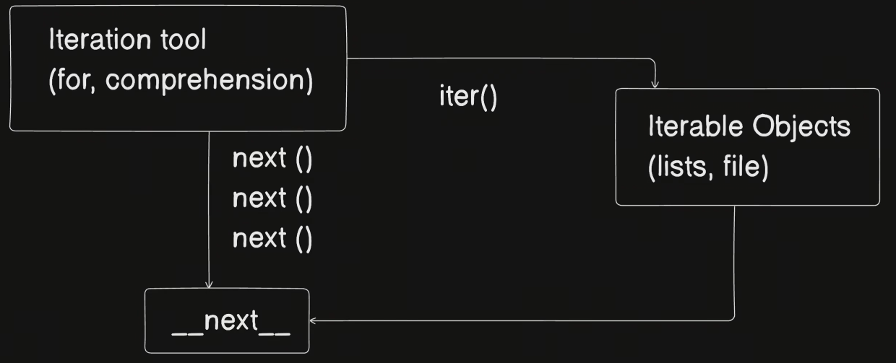
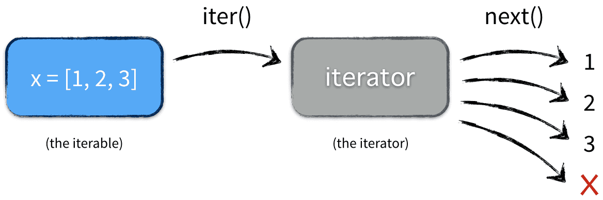

---

## Iteration Tools, Iterable Objects, and the `__next__` Method in Python

### Iteration Tools

#### 1. For Loop
A `for` loop is used to iterate over an iterable object, retrieving one element at a time until there are no elements left.

```python
for item in [1, 2, 3]:
    print(item)
```

#### 2. Comprehensions
Comprehensions provide a concise way to create lists, sets, dictionaries, or generators.

- **List Comprehension**: `[expression for item in iterable]`
- **Set Comprehension**: `{expression for item in iterable}`
- **Dictionary Comprehension**: `{key: value for item in iterable}`
- **Generator Comprehension**: `(expression for item in iterable)`

```python
# List comprehension
squares = [x**2 for x in range(10)]
```

### Iterable Objects

Iterable objects are objects that can be looped over (iterated over). They include sequences like lists, tuples, and strings, as well as many other types like dictionaries, sets, and even files.

#### Examples of Iterable Objects

- **Lists**: `['a', 'b', 'c']`
- **Tuples**: `(1, 2, 3)`
- **Strings**: `'hello'`
- **Dictionaries**: `{'key1': 'value1', 'key2': 'value2'}`
- **Sets**: `{1, 2, 3}`
- **Files**: `open('file.txt')`

### Iterators and the `__next__` Method

An iterator is an object that represents a stream of data; it returns the next item in the stream when you call its `__next__` method. When an iterator has no more items to return, it raises a `StopIteration` exception.

#### Creating an Iterator

To create an iterator from an iterable, you use the `iter()` function. Once you have an iterator, you can retrieve items from it one at a time using the `next()` function or by using a `for` loop.

```python
# List is an iterable
my_list = [1, 2, 3]

# Get an iterator from the list
iterator = iter(my_list)

# Retrieve items using next()
print(next(iterator))  # Output: 1
print(next(iterator))  # Output: 2
print(next(iterator))  # Output: 3

# This will raise a StopIteration exception
# print(next(iterator))
```

### How They Are Connected

1. **Iterable Objects**: These are objects that can return an iterator. They have an `__iter__()` method that returns an iterator.
2. **Iterators**: These are objects that represent a stream of data. They have a `__next__()` method that returns the next item in the stream.
3. **For Loops and Comprehensions**: These are tools for iterating over iterable objects. Under the hood, a `for` loop calls the `iter()` function to get an iterator and then repeatedly calls the iterator's `__next__()` method to get each item until `StopIteration` is raised.

### Example Bringing It All Together

```python
# Iterable object: List
my_list = [1, 2, 3]

# Creating an iterator from the iterable
iterator = iter(my_list)

# Using a for loop to iterate over the list
for item in my_list:
    print(item)  # This implicitly calls iter(my_list) and next(iterator)

# Manually iterating using the iterator
while True:
    try:
        item = next(iterator)
        print(item)
    except StopIteration:
        break

# Using list comprehension to create a new list from an iterable
squares = [x**2 for x in range(10)]
print(squares)
```

In summary, iterable objects, iterators, and iteration tools like `for` loops and comprehensions are all connected parts of Python's iteration protocol. Iterable objects can be turned into iterators, and iterators can be used to retrieve items one at a time, either manually or through iteration tools.



---